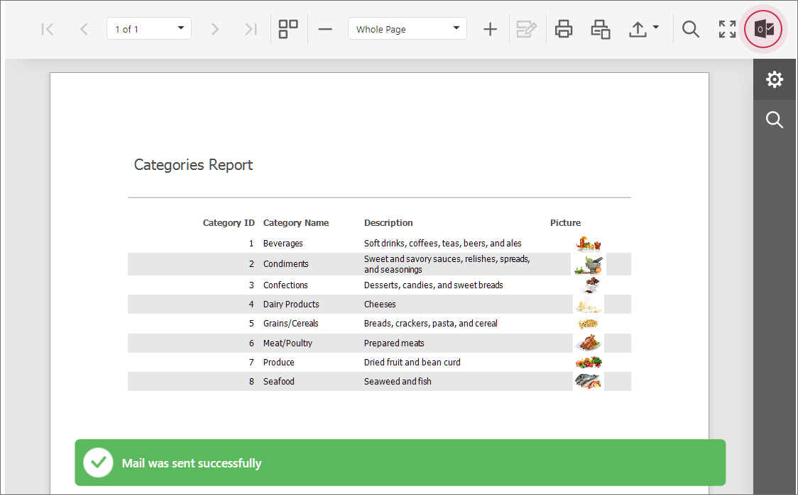
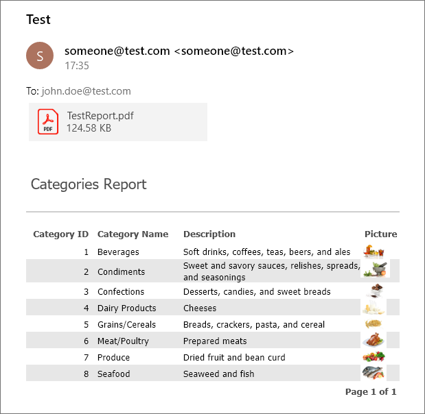

<!-- default badges list -->

<!-- default badges end -->
# Reporting for ASP.NET MVC - How to Email a Report from the Document Viewer

This example adds a custom action button to the Document Viewer that triggers a custom operation on the server side. The server-side custom operation exports a report to HTML and PDF, and emails the resulting documents.

When you run the application, you observe the Document Viewer with a newly added action button:

 To email a report, click the button. The application attempts to send email to `someone@test.com` using the `localhost` SMTP server, port 25. Modify the code to apply your mail server settings.

 The report sent by email is shown in the following image:

When the user clicks the 'Send via Email' button, the client-side [PerformCustomDocumentOperation](https://docs.devexpress.com/XtraReports/js-ASPxClientWebDocumentViewer#js_aspxclientwebdocumentviewer_performcustomdocumentoperation) method passes data to the [DocumentOperationService](https://docs.devexpress.com/XtraReports/DevExpress.XtraReports.Web.WebDocumentViewer.DocumentOperationService) on the server. The service exports the report to PDF and HTML formats, creates the [MIME message](http://www.mimekit.net/docs/html/T_MimeKit_MimeMessage.htm) and sends email using the [MailKIt](https://github.com/jstedfast/MailKit) client.

The [PerformCustomDocumentOperation](https://docs.devexpress.com/XtraReports/js-ASPxClientWebDocumentViewer#js_aspxclientwebdocumentviewer_performcustomdocumentoperation) method returns an object that implements the  [IDocumentOperationResult](https://docs.devexpress.com/XtraReports/js-DevExpress.Reporting.Viewer.Utils.IDocumentOperationResult) interface, so you can return the data from the [DocumentOperationService](https://docs.devexpress.com/XtraReports/DevExpress.XtraReports.Web.WebDocumentViewer.DocumentOperationService) to the client.

## Files to Review

* [Global.asax.cs](./CS/CustomDocumentOperationService/Global.asax.cs) (VB: [Global.asax.vb](./VB/CustomDocumentOperationService/Global.asax.vb))
* [CustomDocumentOperationService.cs](./CS/CustomDocumentOperationService/Services/CustomDocumentOperationService.cs) (VB: [CustomDocumentOperationService.vb](./VB/CustomDocumentOperationService/Services/CustomDocumentOperationService.vb))
* [Viewer.cshtml](./CS/CustomDocumentOperationService/Views/Home/Viewer.cshtml) (VB: [Viewer.vbhtml](./VB/CustomDocumentOperationService/Views/Home/Viewer.vbhtml))

## Documentation

- [DocumentOperationService](https://docs.devexpress.com/XtraReports/DevExpress.XtraReports.Web.WebDocumentViewer.DocumentOperationService)
- [PerformCustomDocumentOperation](https://docs.devexpress.com/XtraReports/js-ASPxClientWebDocumentViewer?f=DocumentOperationService#js_aspxclientwebdocumentviewer_performcustomdocumentoperation)
- [Services in the Document Viewer](https://docs.devexpress.com/XtraReports/400226/web-reporting/asp-net-mvc-reporting/document-viewer-in-asp-net-mvc-applications/customization/register-services-in-the-document-viewer)

## More Examples

- [Reporting for WinForms - How to Use MailKit to Email a Report](https://github.com/DevExpress-Examples/reporting-winforms-mailkit-email-report-pdf)
- [Reporting for Blazor - Email a Report from the Native Blazor Report Viewer](https://github.com/DevExpress-Examples/reporting-blazor-email-report)
<!-- feedback -->
## Does this example address your development requirements/objectives?

 

(you will be redirected to DevExpress.com to submit your response)
<!-- feedback end -->
